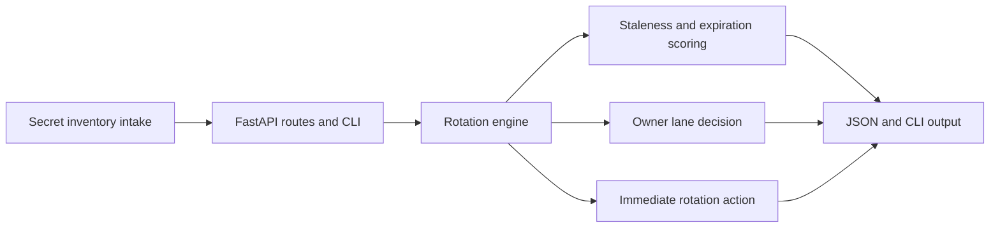

# Secret Rotation Scheduler

Secret Rotation Scheduler is a Python and FastAPI backend for converting credential age, expiration pressure, and ownership gaps into explicit rotation decisions. It treats secret hygiene as an operating system concern instead of a background checklist.

## Portfolio Takeaway

- Python backend with practical security-hygiene logic
- stale rotation, break-glass exposure, and missing backup ownership turned into concrete action
- JSON API, CLI, tests, docs, and real PNG proof

## Overview

| Area | Details |
| --- | --- |
| Language | Python 3.11+ |
| Framework | FastAPI |
| Focus | Secret rotation scheduling, stale credential detection, backup ownership, expiration pressure |
| Routes | `/`, `/docs`, `/api/dashboard/summary`, `/api/secrets`, `/api/secrets/{id}`, `/api/sample`, `/api/analyze/rotation` |
| Extra | CLI at `python -m app.cli` |

## What It Does

- models secret inventory with owner lanes, expiration windows, and break-glass posture
- scores each payload into `stable`, `watch`, or `escalate`
- returns a rotation decision of `schedule`, `prioritize`, or `rotate-now`
- exposes a JSON API and CLI that can feed runbooks, internal consoles, or reminder workflows

## Architecture



Additional detail lives in [C:\Users\chaus\dev\repos\secret-rotation-scheduler\docs\architecture.md](/C:/Users/chaus/dev/repos/secret-rotation-scheduler/docs/architecture.md).

## Example Payload

```json
{
  "id": "sec-7401",
  "system": "billing-export",
  "owner_lane": "platform-security",
  "environment": "prod",
  "secret_type": "api-key",
  "rotation_window_days": 30,
  "days_since_rotation": 43,
  "expires_in_days": 6,
  "is_break_glass": false,
  "has_backup_owner": false,
  "last_rotation_actor": "billing-platform",
  "next_steps": [
    "Assign a backup owner before the next rotation attempt."
  ],
  "blockers": [
    "Rotation runbook still references the legacy export path."
  ]
}
```

## Screenshots

### Hero


### Queue Lanes


### Rotation Decision


### Validation Proof


## Local Run

```powershell
Set-Location "C:\Users\chaus\dev\repos\secret-rotation-scheduler"
py -3.11 -m venv .venv
.\.venv\Scripts\python.exe -m pip install -r requirements.txt
.\.venv\Scripts\python.exe -m uvicorn app.main:app --reload --port 4461
```

Then open:

- `http://127.0.0.1:4461/`
- `http://127.0.0.1:4461/docs`

CLI:

```powershell
.\.venv\Scripts\python.exe -m app.cli
```

## Tech Stack

[](https://www.python.org/)
[](https://fastapi.tiangolo.com/)

## Portfolio Links

- [Kinetic Gain](https://kineticgain.com/)
- [LinkedIn](https://www.linkedin.com/in/mirzacausevic)
- [GitHub](https://github.com/mizcausevic-dev)
- [Skills Page](https://mizcausevic.com/skills/)
